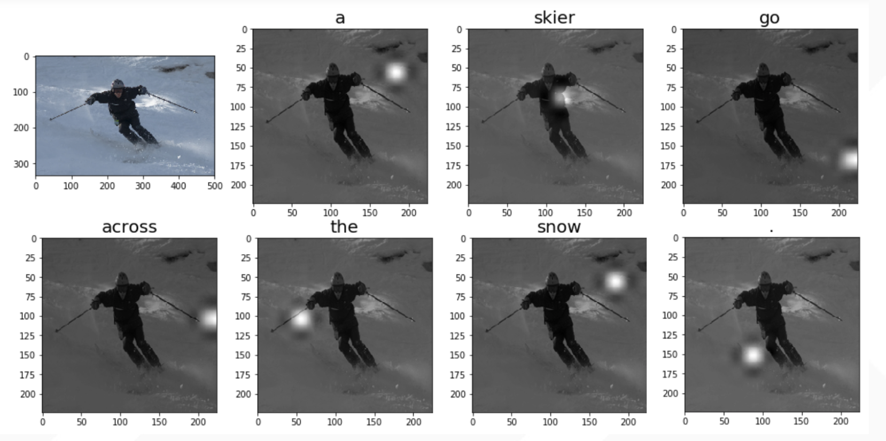
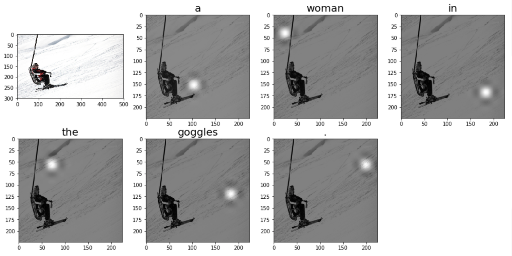
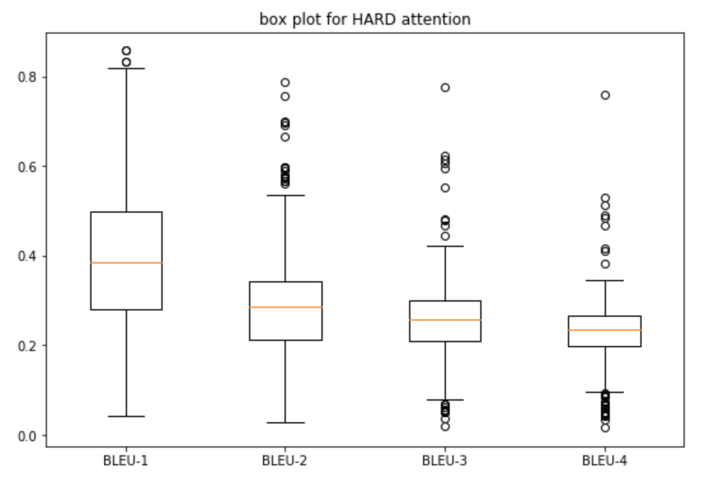
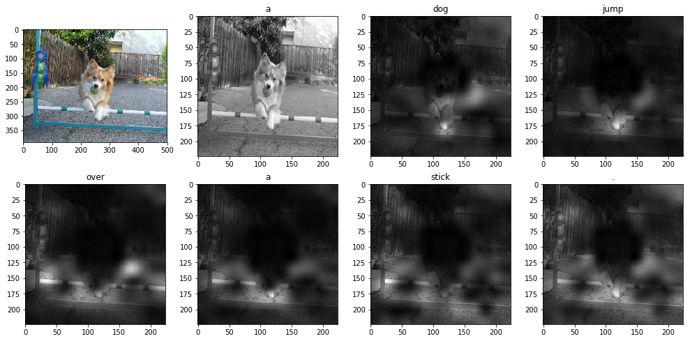
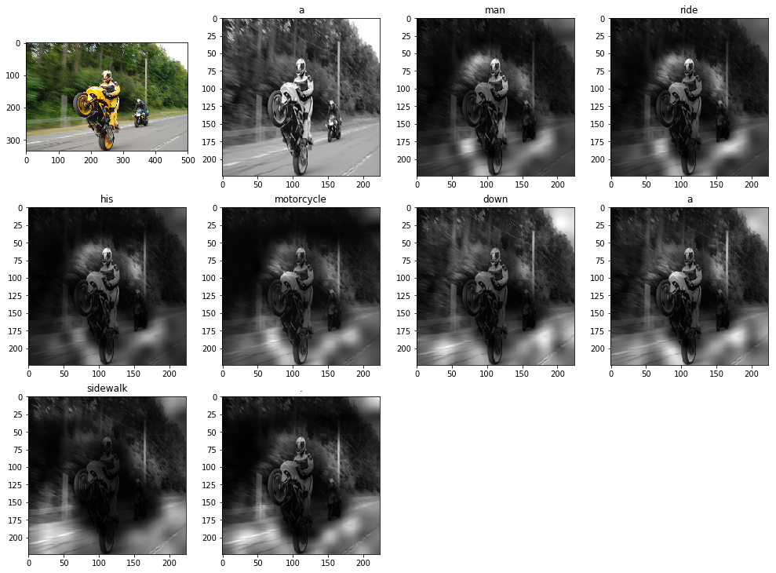
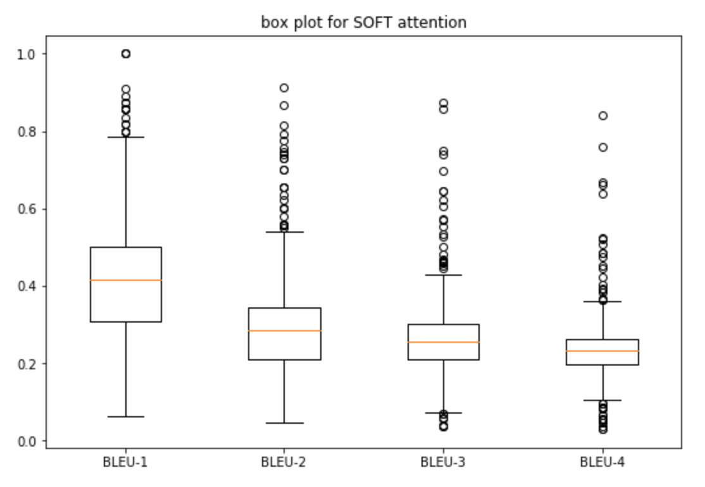

# visual-attention-image-caption

## References
This pytorch implementation is based on Xu, Kelvin, et al. "Show, attend and tell: Neural image caption generation with visual attention." International Conference on Machine Learning. 2015. available at https://arxiv.org/pdf/1502.03044.pdf
Author's theano code: https://github.com/kelvinxu/arctic-captions 

The dataset I used is the Flickr8K dataset.

## Results
 
 

#### Stochastic Hard Attention Model

##### (1) Generated caption: a skier go across the snow .

##### (2) Generated caption: a woman in the goggles .

##### BLEU Scores:

#### Deterministic Soft Attention Model

##### (1) Generated caption: a dog jump over a stick .

##### (2) Generated caption: a man ride his moterocycle down a sidewalk .

##### BLEU Scores:

